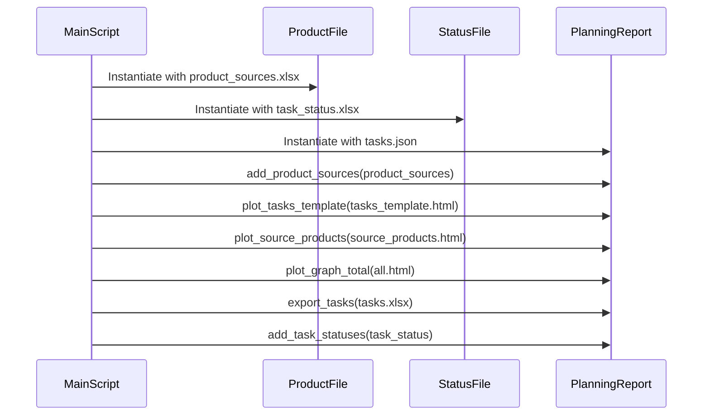
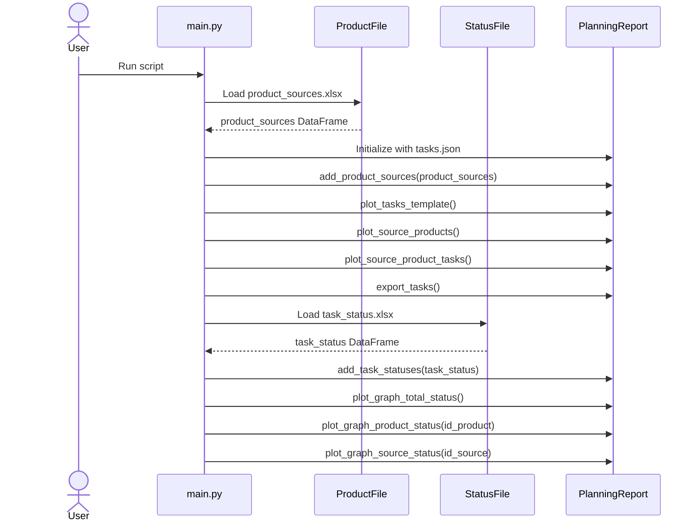

# Migration planning

Data migration planning and progress report tool. Orchestrates the import of source systems, product and task status data, processes this data using a planning report component, and generates various detail output files (HTML visualizations and an Excel export).

It consists of two modules, one started by running the `src/main.py` file, with the following sequence. This reports on the detailed task dependencies for migrating the ETL of source systems to products.

The second part serves a management dashboard by running `src/dashboard/app.py` which is served on [http://127.0.0.1:8050/](http://127.0.0.1:8050/).

The sequence diagram is:

