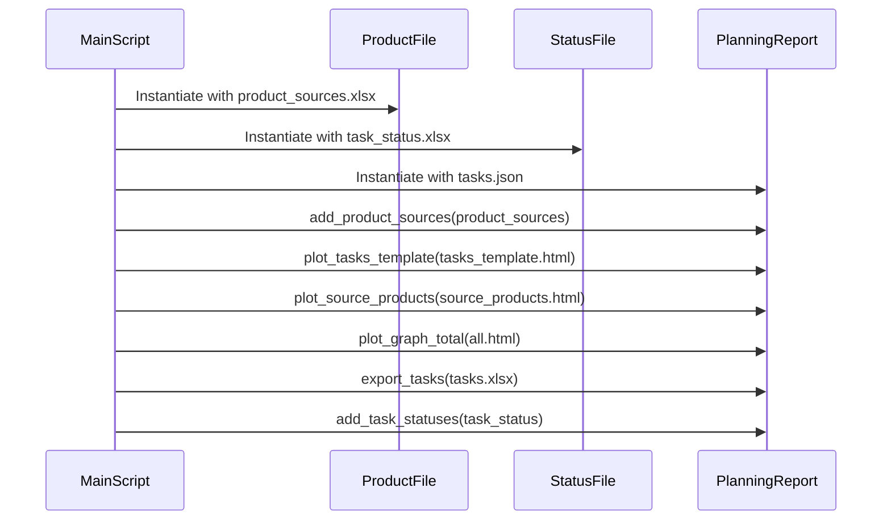

# Migration planning

Data migration planning and progress report tool.  Orchestrates the import of product and status data, processes this data using a planning report component, and generates various output files (HTML visualizations and an Excel export).

